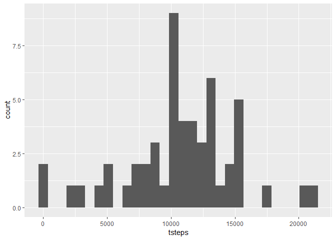
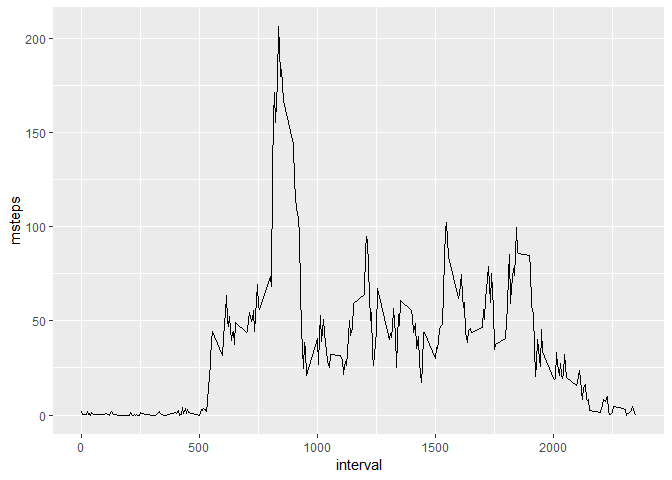
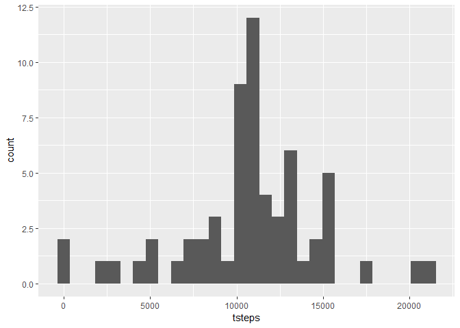
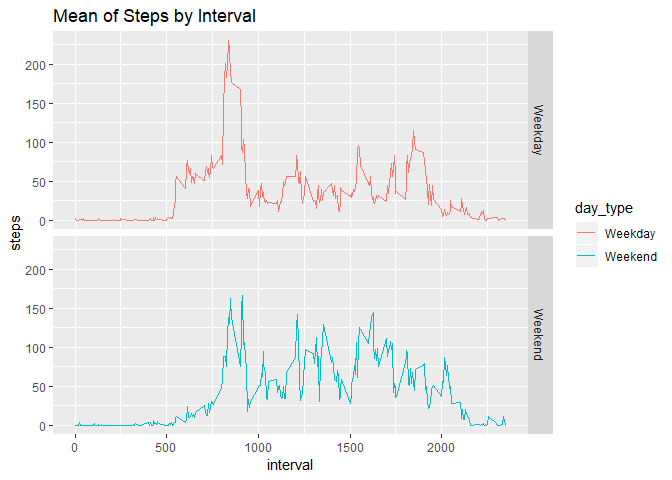

Project 1
---------

    library(lubridate)

    ## 
    ## Attaching package: 'lubridate'

    ## The following object is masked from 'package:base':
    ## 
    ##     date

    library(dplyr)

    ## 
    ## Attaching package: 'dplyr'

    ## The following objects are masked from 'package:lubridate':
    ## 
    ##     intersect, setdiff, union

    ## The following objects are masked from 'package:stats':
    ## 
    ##     filter, lag

    ## The following objects are masked from 'package:base':
    ## 
    ##     intersect, setdiff, setequal, union

    library(ggplot2)

##### Loading Dataset:

    activity <- read.csv("input/activity.csv")
    activity$date <- ymd(activity$date)

##### Sample data:

    head(activity)

    ##   steps       date interval
    ## 1    NA 2012-10-01        0
    ## 2    NA 2012-10-01        5
    ## 3    NA 2012-10-01       10
    ## 4    NA 2012-10-01       15
    ## 5    NA 2012-10-01       20
    ## 6    NA 2012-10-01       25

### Analysis by Day

##### Total Steps taken each Day:

    tot_steps <- activity %>% group_by(date) %>% summarize(tsteps=sum(steps)) %>% na.omit()
    ggplot(tot_steps, aes(x=tsteps)) + geom_histogram()

    ## `stat_bin()` using `bins = 30`. Pick better value with `binwidth`.

    mn <- mean(tot_steps$tsteps)

    md <- median(tot_steps$tsteps)

Mean = 1.076618910^{4} Median = 10765

### Analysis by Interval

##### Average Steps by 5 minute interval:

    avg_steps <- activity %>% group_by(interval) %>% summarize(msteps=mean(steps, na.rm = TRUE))
    ggplot(avg_steps, aes(x=interval, y=msteps)) + geom_line()

    max_stps <- avg_steps[avg_steps$msteps==max(avg_steps$msteps), "interval"]

The average steps is maximum at: 835 time interval of the day

### Imputing missing values

    missingval <- sum(is.na(activity))

There are totally 2304 rows with missing values

The missing values are imputed with mean steps in that 5 minute interval

##### Sample data after imputing:

    fill_missing <- activity %>% group_by(interval) %>% summarize(msteps=mean(steps, na.rm = TRUE)) %>%
      right_join(activity) %>% mutate(steps = ifelse(is.na(steps), msteps, steps)) %>% select(-msteps)

    ## Joining, by = "interval"

    head(fill_missing)

    ## # A tibble: 6 x 3
    ##   interval  steps date      
    ##      <int>  <dbl> <date>    
    ## 1        0 1.72   2012-10-01
    ## 2        5 0.340  2012-10-01
    ## 3       10 0.132  2012-10-01
    ## 4       15 0.151  2012-10-01
    ## 5       20 0.0755 2012-10-01
    ## 6       25 2.09   2012-10-01

##### Total steps taken each Day after imputing missing values:

    tot_steps <- fill_missing %>% group_by(date) %>% summarize(tsteps=sum(steps)) %>% na.omit()

    mn_imp <- mean(tot_steps$tsteps)
    md_imp <- median(tot_steps$tsteps)

    ggplot(tot_steps, aes(x=tsteps)) + geom_histogram()

    ## `stat_bin()` using `bins = 30`. Pick better value with `binwidth`.

Mean after imputing = 1.076618910^{4} Median after imputing =
1.076618910^{4}

The mean and median are now equal after imputation. This suggests that
the data is symmetrical.

### Weekday Vs Weekend Analysis

    activity_weekday <- fill_missing %>% mutate(day = weekdays(date)) %>% 
      mutate(day_type = ifelse(((day == "Saturday") | (day == "Sunday")), "Weekend", "Weekday")) %>%
      mutate(day_type = as.factor(day_type))

    head(activity_weekday)

    ## # A tibble: 6 x 5
    ##   interval  steps date       day    day_type
    ##      <int>  <dbl> <date>     <chr>  <fct>   
    ## 1        0 1.72   2012-10-01 Monday Weekday 
    ## 2        5 0.340  2012-10-01 Monday Weekday 
    ## 3       10 0.132  2012-10-01 Monday Weekday 
    ## 4       15 0.151  2012-10-01 Monday Weekday 
    ## 5       20 0.0755 2012-10-01 Monday Weekday 
    ## 6       25 2.09   2012-10-01 Monday Weekday

##### Average interval analysis: Weekday Vs Weekend

    avg_steps <- activity_weekday %>% group_by(interval, day_type) %>% summarize(msteps=mean(steps, na.rm = TRUE))
    ggplot(avg_steps, aes(x=interval, y=msteps, color=day_type)) + 
      geom_line() + 
      facet_grid(day_type ~ .) +
      labs(title = "Mean of Steps by Interval", x = "interval", y = "steps")

We can clearly see that, activity is higher throughout the day during
weekends than in weekdays
